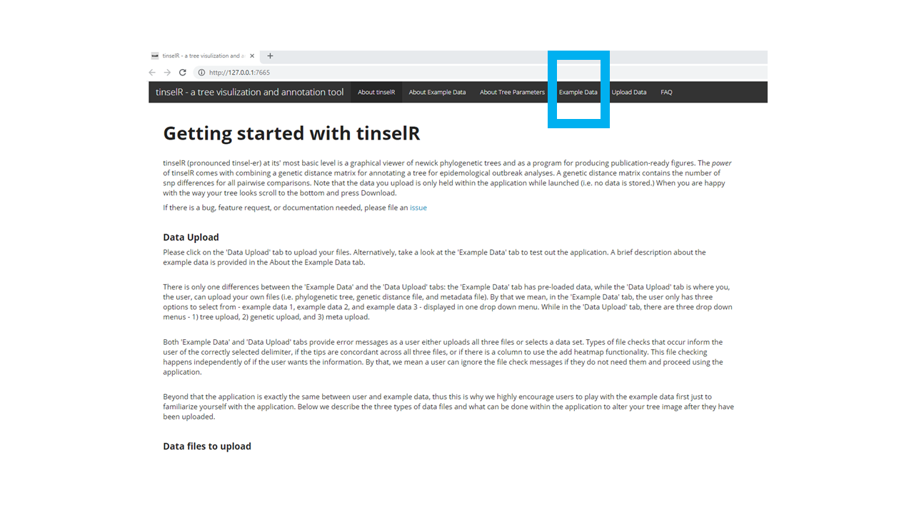
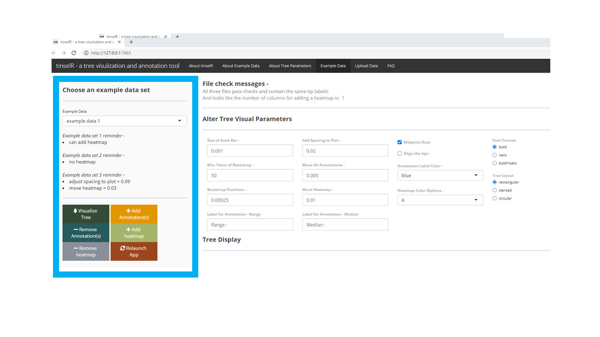

# Summary

Across the United States, public health laboratories at the state-level now
perform whole-genome sequencing for foodborne pathogens, a milestone for
protecting our food sources by identifying bacterial contamination at a higher
resolution than previously. To understand organismal relationships in response
to outbreak investigations from whole-genome data, building and interpreting
phylogenetic trees are essential for this public health workflow. Placing
new outbreak isolates within the broader context of species diversity allows for
identification across temporal or spatial scales regarding similarities or
differences for those newly sequenced isolates. Thus, our goal was to develo
an open-source graphical user interface for phylogenetic tree visualization and
annotation for both external (state public health laboratories) partners and
internal users. Given that many state public health laboratories have limited
bioinformatics support one of our main constraints is that the application be
free and easily installable. To accomplish this goal, we developed **tinselR**
(pronounced tinsel-er) using the Rshiny framework as a R package.
Beyond the above requirements listed for developing this application,
we choose the R programming languagebecause of R's base graphics and additional
phylogenetic packages that are the gold standard for phylogenetic tree graphics.
Our tool's minimum input requirements are a Newick formatted phylogenetic tree
in which user-selected inputs change parameters of the visualized tree.
For example, a user can quickly transform tip labels to either bold or bold and
italic font format. With a genetic distance matrix or the metadata file, or
both, the user can include annotations on the image, quickly adjust tip labels,
or add a heatmap to the phylogenetic tree. These modified phylogenetic tree
images are downloadable in various formats for presentations or publications.
These images help public health officials and stakeholders discuss the
differences or similarities between isolates in response to outbreaks. Below,
we detail how to install the application and describe the example data that is
pre-loaded so that a new user can familiarize themselves with the application.

# Installation

**1). Install devtools package**
 
Run the below code in your R console -    
 
`install.packages("devtools", dep=T)`
 
**2). Install ggtree and treeio**
 
```
if (!requireNamespace("BiocManager", quietly = TRUE))
    install.packages("BiocManager")
BiocManager::install("ggtree")
```

**3). Install and launch the tinselR shiny application**
 
```
devtools::install_github("jennahamlin/tinselR")
library(tinselR)
run_app()
```

# About Pre-loaded Example Data

When the application is launched, the user can test out the application by
using one of the pre-loaded datasets located in the 'Example Data' tab [tinselR landing page with the example data tab indicated in the blue box](#fig:image1).
We provide three datasets (i.e. Newick formatted tree, genetic distance matrix,
and metadata file) already combined with the number of isolates ranging
from 14 - 19. These data are either *Eschericia coli* (NCBI Bioproject:
PRJNA218110) or *Salmonella enterica* (NCBI Bioproject: PRJNA230403). After
clicking on the 'Example Data' tab, the user selects from one drop down menu
for one of the combined datasets (e.g. example data 1, example data 2, and
example data 3.

# Figures


<div id="fig:image1>
 

</div>





 